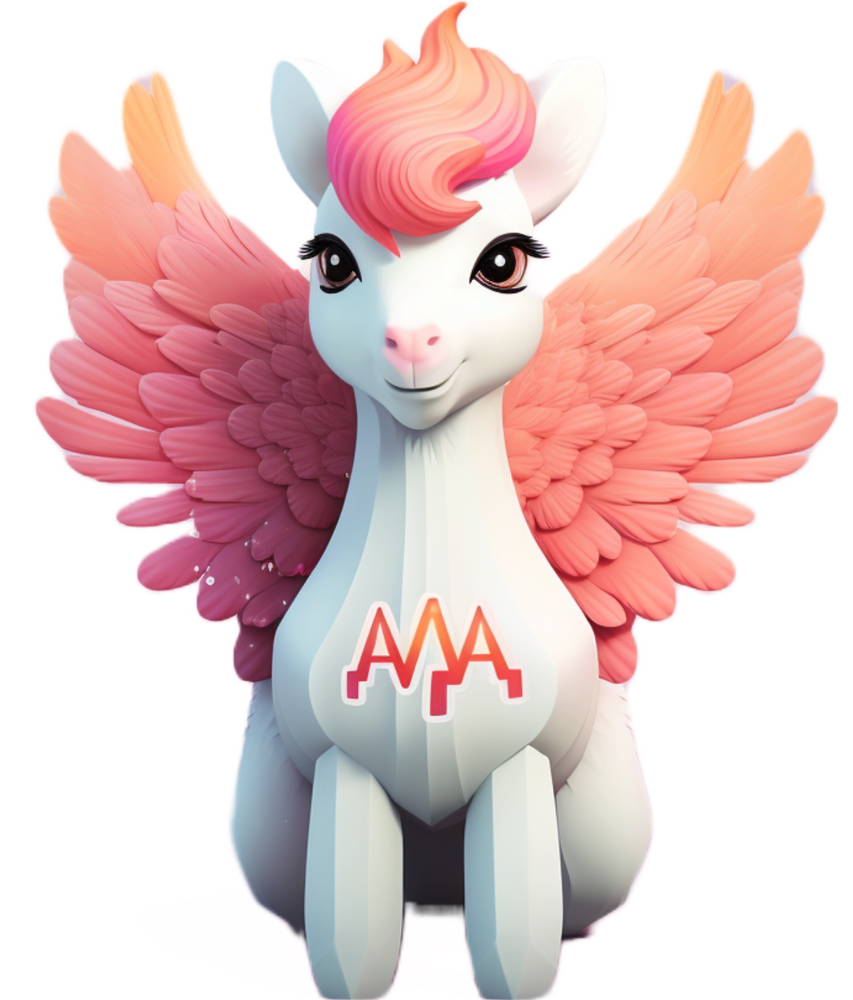
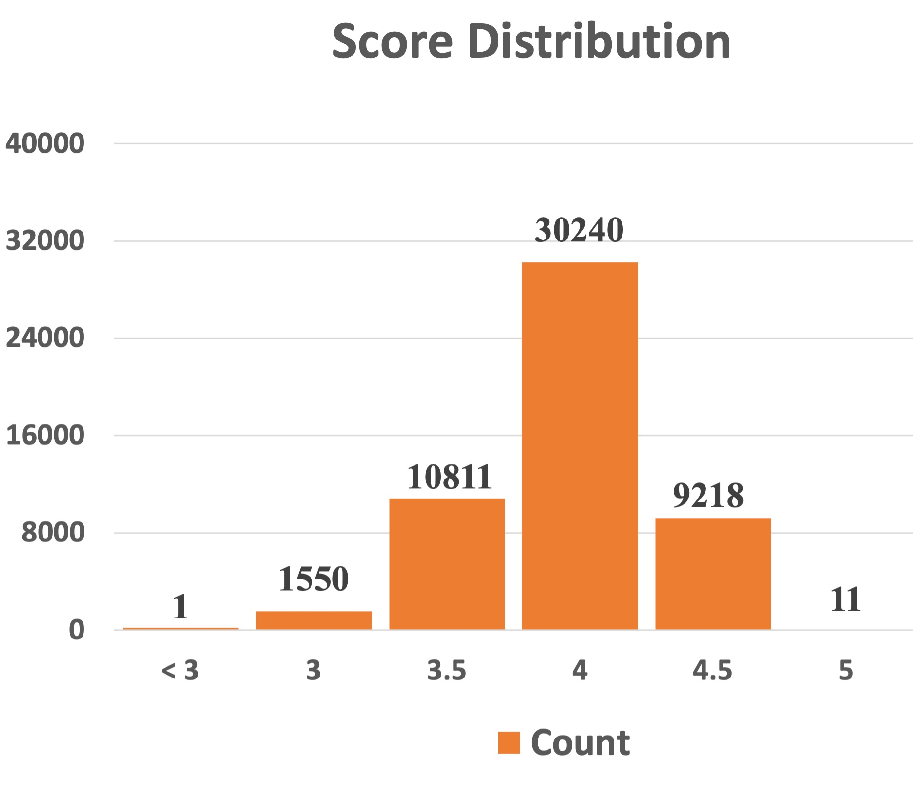
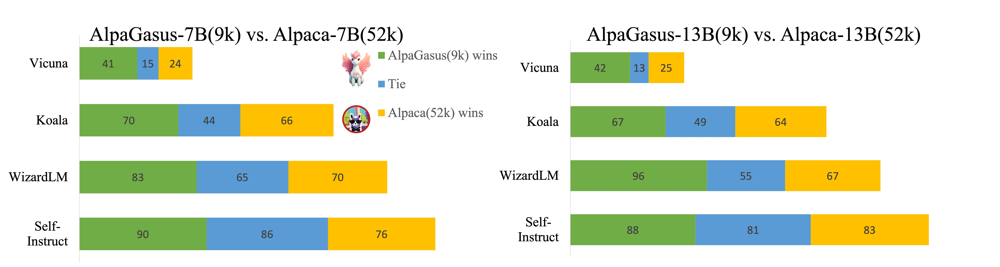

<h1 align="center">AlpaGasus: Training a Better Alpaca Model with Fewer Data</h1>
The unofficial implementation of "AlpaGasus: Training a better Alpaca with Fewer data." Trained models are available at the Huggingface and we will keep updating the filtered data.

## [Project page](https://lichang-chen.github.io/AlpaGasus/) | [Paper](https://arxiv.org/abs/2307.08701) | [Huggingface](https://huggingface.co/gpt4life/)

This repo contains:

- The filtered data used for instruction-finetuning the model.
- The code for filtering the data.
- The scripts for fine-tuning the model.
- The code and scripts for the evaluations. 

Note: thanks to the community for providing useful feedbacks, which really stimulates us to a better open-source.

<p align="center">
     <br>
    Our Model "AlpaGasus"is pronounced as "/ˈælpəˈɡeɪsəs/", or "/ˈælpəˈɡəsəs/". The logo is generated by <a href="https://www.midjourney.com/app/">Midjourney</a>
</p>


## News
- [2023.9] We really appreciate the effort by @[gauss5930](https://github.com/gauss5930) and @[YooYunS](https://github.com/YooYunS)  who implemented the QLoRA version of Alpagasus-7B and 13B. If you do not have enough computational resources, please refer to their repo: [Alpagasus2-QLoRA](https://github.com/gauss5930/AlpaGasus2-QLoRA)
- [2023.9] We also filter the [Databricks Dolly](https://huggingface.co/datasets/databricks/databricks-dolly-15k) dataset, which contains 15k data and is originally considered as the high-quality human-written dataset. We release the filtered data which contain only 20% of the original data. Training with filtered dataset can make the model perform much better than with the original 15k data.


## Setup
```
pip install -r requirement.txt
```

## Rating
Rate each (instruction, input, output) tuple in the Alpaca's 52k training set.
```
# Use ChatGPT as the response quality evaluator
export YOUR_OPENAI_API_KEY
# Use Claude as the response quality evaluator
export YOUR_CLAUDE_API_KEY
```
After the rating, you will need to use `rating/filter.py` and `rating/get_scores.py` to process your reviews obtained from ChatGPT/Claude.

## Data Release
- `data/filtered/chatgpt_9k.json` is the filtered data from 52k instruction-following data of Alpaca, which is a list of dictionaries and has the same format as alpaca data. We utilize ChatGPT as response quality evaluator and use the threshold 4.5 for filtering the low-quality data.
- `data/filtered/dolly_3k.json` is the filtered data from 15k high-quality human-written data of Databricks Dolly dataset, which is also a list of dictionaries, each containing the fields: "instruction", "input", "output", and "category". Note: we change the name of the original field "context" into "input" to make it compatible with the training file.
- `data/filtered/claude_t45.json`, we use Claude to filter the data and `t45` means the threshold is 4.5, where the data format is also the same as the Alpaca. 
- `data/random/random_9k.json` file which is randomly selected from the original Alpaca dataset.


## Score distribution
We provide the score distribution of the chatgpt rating here:

<p align="center">
     <br>
    We use the same prompt as the Alpagasus paper and get the score distribution shown as above, then we select 9k data by applying the threshold 4.5 and get the "chatgpt_9k.json".
</p>
<br>

## Training
- We provide some scripts for training the 7B and 13B models. Since we use FSDP, it requires 4x and 8x 80GB A100  for training 7B and 13B model, respectively.

```
# prepare the data 
sh training/train_7b.sh
```
- For the instruction-finetuning of LLaMA-13B:
```
sh training/train_13b.sh
```


- Also, if you do not have enough computing resources, you could consider using deepspeed. Here is an example for training 13b model on 8 x 40GB A100:
```
pip install deepspeed
torchrun --nproc_per_node=4 --master_port=<your_random_port> ./training/train_alpaca.py \
    --model_name_or_path <your_path_to_hf_converted_llama_ckpt_and_tokenizer> \
    --data_path ./data/filtered/dolly_3k.json \
    --bf16 True \
    --output_dir <your_output_dir> \
    --num_train_epochs 3 \
    --per_device_train_batch_size 1 \
    --per_device_eval_batch_size 1 \
    --gradient_accumulation_steps 32 \
    --evaluation_strategy "no" \
    --save_strategy "steps" \
    --save_steps 2000 \
    --save_total_limit 1 \
    --learning_rate 2e-5 \
    --weight_decay 0. \
    --warmup_ratio 0.03 \
    --deepspeed "./config/ds_config_13b.json" \
    --tf32 True
```

## Evaluation
- Instruction-following evaluation: We tried to follow the evaluation metric introduced by the AlpaGasus paper. We use the gpt-4-0613 as the evaluator model.
The evaluation result of AlpaGasus-7B and 13B models are as follows:
<p align="center">
     <br>
    We evaluate the models on four testsets: Koala, Vicuna, WizardLM, and Sinstrcut. Our Alpagasus can be significantly better than the baseline models.
</p>

 We also provide the code and scripts for evaluating the models with these four testsets:
 ```
export OPENAI_API_KEY
cd evaluation/
sh run_eval.sh
```

- For the other benchmark results, stay tuned!


## References
- [WizardLM](https://github.com/nlpxucan/WizardLM)
- [Koala](https://github.com/young-geng/EasyLM/tree/main)
- [Vicuna](https://vicuna.lmsys.org/)
- [GPT-4-Report](https://arxiv.org/pdf/2303.08774.pdf)

## Citation
If you think it is a useful repo, please cite the paper:
```bibtex
@article{chen2023alpagasus,
  title={Alpagasus: Training a better alpaca with fewer data},
  author={Chen, Lichang and Li, Shiyang and Yan, Jun and Wang, Hai and Gunaratna, Kalpa and Yadav, Vikas and Tang, Zheng and Srinivasan, Vijay and Zhou, Tianyi and Huang, Heng and others},
  journal={arXiv preprint arXiv:2307.08701},
  year={2023}
}
```
